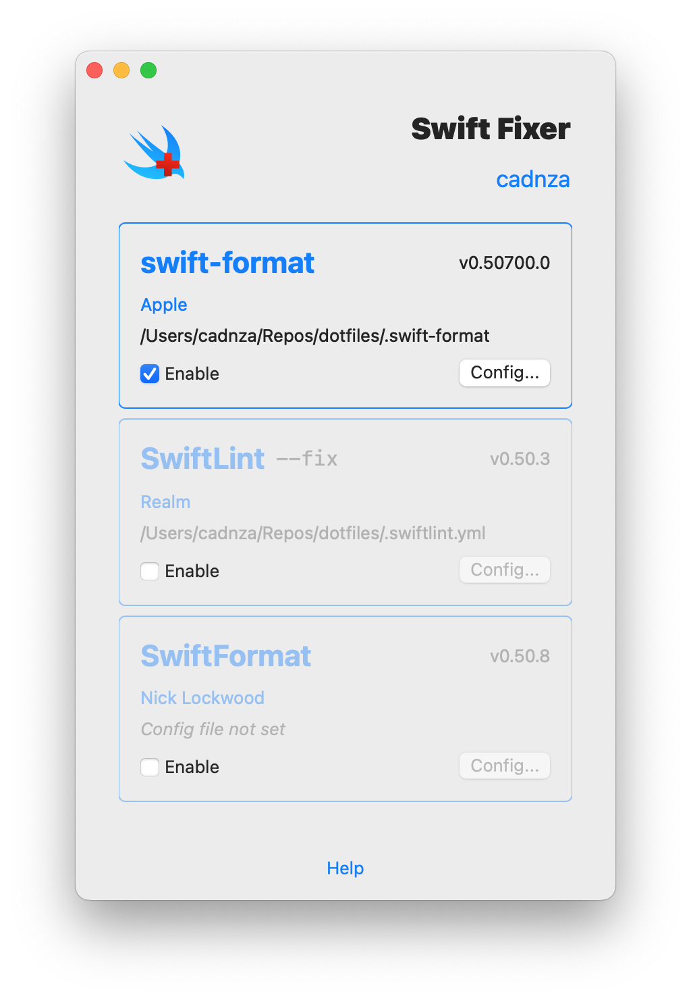
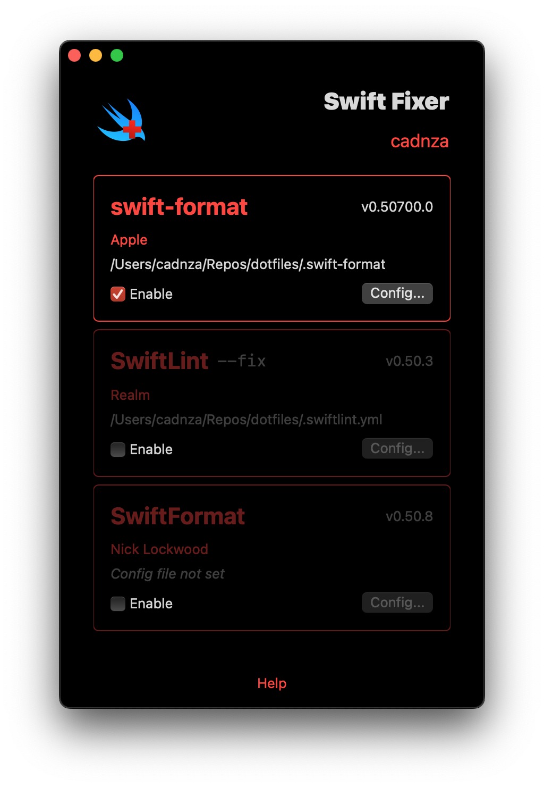

# Swift Fixer

Swift formatter extension for Xcode 🔨

… Although, technically, this isn't actually a formatter—it's an Xcode extension that goes and gets your favorite formatter and applies it to your Swift code with a config file that lives somewhere on your machine.

## Installation

[Download](https://github.com/cadnza/swift-fixer/releases) the [latest release](https://github.com/cadnza/swift-fixer/releases).

## Setup

 
